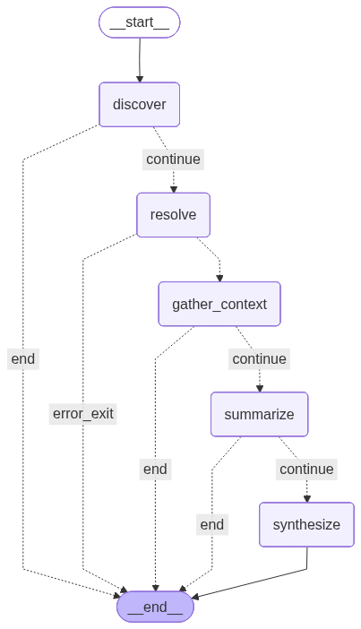

# Mini Data Platform — GTM Edition

This repo is a synthetic data platform containing mock GTM data — CRM records, sales call intelligence, marketing automation, and product analytics — along with Airflow DAGs, dbt models, Evidence dashboards, and a DuckDB data warehouse.

## Assignment

Build an agent that, given an account or prospect, pulls together relevant internal context — deal history, product usage, call intelligence, marketing engagement — and drafts a personalized outreach email. Try to discover the schema dynamically rather than hardcoding table and column names. No requirements around languages, model providers, or methods — we want to see how you think about these problems.

To submit, send us a link to your fork with a README outlining your approach and where you'd continue building if you had more time. This should take no more than a few hours.

We're looking forward to seeing your work!


## Agent: Personalized Outreach Email Generator

Given an account or prospect name, the agent dynamically discovers the warehouse schema, gathers relevant context across CRM, sales intelligence, marketing, and product analytics data, and drafts a personalized outreach email grounded in real data.

### Getting Started

**Prerequisites**: Python 3.13+, an `ANTHROPIC_API_KEY` in a `.env` file at the project root.

The repo ships with synthetic data and a populated DuckDB warehouse, so you can run the agent immediately. To regenerate fresh data, refer to [Quick Setup](#quick-setup) below.

```bash
uv sync

source .venv/bin/activate 

echo 'ANTHROPIC_API_KEY=your-key-here' > .env
```

There are two ways to interact with the agent:

**CLI** — quick, single-run execution:

```bash
python -m agent.cli "Account Name"

# With verbose output (shows each node's progress on stderr):
python -m agent.cli "Account Name" --verbose
```

**Streamlit App** — interactive UI with live tool call visibility:

```bash
streamlit run agent/app.py
# Open http://localhost:8501
```

The app displays each graph node as it executes, shows SQL queries in expandable panels, and renders the final email alongside the analyst summary.

Both interfaces accept account names (e.g. "Catalyst Systems") or person names (e.g. "Eve Lopez"). When a person is searched, the agent resolves them to their row and the query planner follows foreign keys like `account_id` to pull account context during gathering.

### Architecture & LangGraph Flow

5-node LangGraph state machine. A single Pydantic `AgentState` flows through the graph; each node reads what it needs and writes back. All LLM calls use Claude Sonnet via `langchain-anthropic`. Conditional edges after each node check for errors and short-circuit to `END`.



**1. Discover** — Queries `information_schema` for all columns/types in `staging` and `marts`, then parses dbt `manifest.json` for model dependencies and mart SQL.

**2. Resolve** — Finds the target entity. Queries `information_schema` to dynamically discover tables with identity columns (`name`, `account_name`, `company`, `email`, `first_name`, `last_name`) and runs `ILIKE` searches. The resolved entity is returned as a raw row dict; no account enrichment happens here. When a person is found, their `account_id` is visible to the downstream query planner, which handles the account lookup naturally.

If heuristics find nothing, an LLM fallback gets the `run_query` tool with the full schema and writes its own search SQL. Both paths return the same dict shape so downstream nodes get a consistent entity structure.

**3. Gather Context** — The core node. An LLM reads the schema, dbt SQL, and entity metadata, then generates a JSON array of `{table, sql}` query plans executed against DuckDB (read-only, 50-row cap). Runs up to 3 rounds; after each, the LLM sees results plus a coverage report of queried vs. unqueried tables. Exits early when: the LLM returns an empty array, a round yields no new data, or all mart tables are covered. SQL errors are fed back so the LLM can self-correct.

**4. Summarize** — Analyst briefing that distills query results into outreach angles: timeline reversals, contradictions, competitor mentions, overdue deals, stakeholder gaps. Deliberately separate from synthesize because combining them into one LLM call degraded both outputs.

**5. Synthesize** — Writes the email. Receives the structured data rows (source of truth) and analyst summary (interpretive layer). Grounding rules: never fabricate, cite concrete data points, find a narrative hook, never mention internal system names.

### Design Decisions & Trade-offs

The core problem was enabling the agent to dynamically generate accurate SQL across unfamiliar schemas without hardcoding.

| Approach | Pros | Cons | Verdict |
|---|---|---|---|
| **Hardcoded SQL** | Fast, deterministic | Breaks on schema changes | Too brittle |
| **Single LLM call** | One round-trip | Misses tables it doesn't think to query first pass | Misses depth |
| **Vector Search** | Good for massive dbs (primarily document based) | Overkill. Semantic search struggles with exact column names and SQL syntax logic | Over-engineered. Unnecessary for a universe of 18 tables |
| **Hybrid Search** | Fuse multiple signals (schema embeddings, table popularity, row counts) to rank relevant tables | Over-engineered for 18 tables that fit in context | Over-engineered. Unnecessary for a universe of 18 tables |
| **Full feedback loop** | Maximum coverage | 10+ LLM calls per run | Too slow |
| **Iterative planner with early exit** | Real dbt SQL for joins, 1-3 rounds, exit conditions | 3-5 serial LLM calls | Best middle ground |

Other decisions:

- **Heuristic-first entity resolution.** Burning an LLM call to do `ILIKE '%name%'` is wasteful. The heuristic queries `information_schema` for identity columns and searches dynamically. The fallback catches non-standard schemas.

- **Resolve stays simple.** When a person is searched, resolve returns the raw row without following foreign keys to an account table. The gather_context planner sees the `account_id` in the entity metadata and queries the account table as part of its normal batch. This avoids hardcoding table names in resolve and keeps entity resolution focused on one job.

- **Mart SQL only in context.** Staging models are `SELECT * FROM raw.table` with cleaning filters. The join relationships live in the marts layer, so only mart SQL is passed to the planner.

- **Consistent entity shape.** Both the heuristic and LLM fallback paths return the same dict structure, preventing silent downstream breakage.

- **SQL errors are context, not failures.** Failed queries and their errors are included in the next round's results so the LLM can self-correct.

### Future Improvements

**Hallucination Checker** — A verification node after `synthesize` that cross-references every factual claim in the email against the structured query results. Claims that don't match any source row get flagged and the email is regenerated. Highest-impact addition for production reliability.

**SQL Guardrails** — The connection is read-only, but there's no validation that the SQL is actually a `SELECT` and no query timeout. A lightweight SQL parser and per-query timeout would harden this.

**RRF Table Selection at Scale** — At 18 tables the schema fits in context. At hundreds, Reciprocal Rank Fusion could fuse multiple signals (embeddings of table/column descriptions, query popularity, row counts) to surface the most relevant tables without LLM calls. The dbt SQL would still provide join relationships; RRF just narrows which tables the planner sees.

**Combining Summarize + Synthesize** — Keeping them separate improved quality, but with a more capable model or better prompting this could save one LLM round-trip per run.

---

## Project Structure

```
mini-data-platform-gtm/
├── agent/
│   ├── app.py
│   ├── cli.py
│   └── core/
│       ├── graph.py
│       ├── state.py
│       ├── tools.py
│       ├── prompts.py
│       └── nodes/
│           ├── discover.py
│           ├── resolve.py
│           ├── context.py
│           ├── summarize.py
│           └── synthesize.py
├── sources/
│   └── postgres/             # All raw source data (CSV files)
├── airflow/
│   ├── dags/                 # Airflow DAGs for ingestion and transformation
│   │   ├── ingest_*.py       # Load data from sources → raw schema
│   │   ├── run_dbt.py        # Run dbt staging → marts pipeline
│   │   └── build_evidence.py # Build Evidence dashboards
│   └── utils/                # Shared utilities (warehouse.py)
├── warehouse/                # DuckDB database (data.duckdb)
├── dbt_project/              # dbt transformations
│   └── models/
│       ├── staging/          # Clean raw data (12 models)
│       └── marts/            # Analytics-ready tables (6 models)
├── evidence/                 # Evidence BI dashboards
│   ├── pages/                # Dashboard pages (pipeline, deals, funnel, forecast, adoption)
│   └── sources/              # SQL queries and DuckDB connection
└── scripts/                  # Data generation scripts
```

## Data Pipeline

### Raw Layer (`raw` schema)

- Loaded by Airflow ingestion DAGs
- 12 tables: accounts, opportunities, stage_history, contacts, contact_roles, leads, calls, call_trackers, campaigns, lead_activities, product_users, product_events

### Staging Layer (`staging` schema)

- Created by dbt
- 12 views with data cleaning (fix negatives, cap impossible values, filter nulls, remove future timestamps, deduplicate)

### Marts Layer (`marts` schema)

- Created by dbt
- 6 denormalized tables:
  - `dim_accounts` — Accounts enriched with pipeline stats, contact counts, segment classification
  - `dim_reps` — Sales rep dimension with win rate, pipeline, call activity metrics
  - `fct_opportunities` — Opportunities joined with account, call stats, call intelligence, multi-threading, lead attribution
  - `fct_calls` — Sales calls with opportunity/account context and tracker topic summaries
  - `fct_funnel` — Lead-to-close funnel with marketing attribution and engagement metrics
  - `fct_product_usage` — Account-level monthly product usage with feature adoption and engagement tiers

## Data Volumes

- **Raw**: ~130K total rows across 12 tables
- **Staging**: Same as raw (views with cleaning)
- **Marts**: ~1K dimension rows + ~40K fact rows
- **Database Size**: ~10-15 MB (DuckDB)

## Evidence Dashboards

The project includes interactive dashboards built with Evidence:

### Available Dashboards

1. **Pipeline Overview** (`/`) — Total pipeline, stage distribution, segment/region breakdown, monthly trends
2. **Deal Intelligence** (`/deals`) — Win/loss analysis, loss reasons, competitive intel from call trackers, call insights
3. **Full Funnel** (`/funnel`) — Lead-to-close conversion rates, channel ROI, marketing attribution, engagement analysis
4. **Forecast** (`/forecast`) — Forecast categories, weighted pipeline, rep commit analysis, quarterly trends
5. **Product Usage** (`/adoption`) — Product usage analytics, feature adoption, engagement tiers, usage vs revenue

## Quick Setup

Run the setup script to initialize everything:

```bash
./setup.sh
```

This will:
1. Generate synthetic GTM data (accounts, opportunities, stage history, contacts, contact roles, leads, calls, trackers, campaigns, activities, product users/events)
2. Initialize Airflow and load data into DuckDB
3. Run dbt transformations (staging → marts)

Then view the dashboards:

```bash
cd evidence
npm install       # First time only
npm run sources   # Build data sources
npm run dev       # Start dev server
# Open http://localhost:3000
```

---

## Manual Setup (Advanced)

<details>
<summary>Click to expand manual setup steps</summary>

### 1. Install dependencies

```bash
uv sync
```

### 2. Generate synthetic data

```bash
uv run python scripts/generate_all.py
```

### 3. Initialize Airflow

First, update `airflow/airflow.cfg` to use an absolute path for the database:

```bash
cd airflow
# Update sql_alchemy_conn in airflow.cfg to:
# sql_alchemy_conn = sqlite:////absolute/path/to/your/mini-data-platform-gtm/airflow/airflow.db

export AIRFLOW_HOME=$(pwd)
uv run airflow db migrate
```

### 4. Run ingestion DAGs

```bash
# From airflow/ directory
export AIRFLOW_HOME=$(pwd)
uv run python dags/ingest_accounts.py
uv run python dags/ingest_opportunities.py
uv run python dags/ingest_stage_history.py
uv run python dags/ingest_contacts.py
uv run python dags/ingest_contact_roles.py
uv run python dags/ingest_leads.py
uv run python dags/ingest_calls.py
uv run python dags/ingest_call_trackers.py
uv run python dags/ingest_campaigns.py
uv run python dags/ingest_lead_activities.py
uv run python dags/ingest_product_users.py
uv run python dags/ingest_product_events.py
```

### 5. Run dbt transformations

```bash
# From airflow/ directory
export AIRFLOW_HOME=$(pwd)
uv run python dags/run_dbt.py

# Or run dbt directly
cd ../dbt_project
uv run dbt build --profiles-dir .
```

</details>

---

### Running Evidence

```bash
cd evidence
npm install       # First time only
npm run sources   # Build data sources
npm run dev       # Start dev server
```

Then open http://localhost:3000 to view dashboards.

**Note**: Evidence connects to the DuckDB warehouse at `../warehouse/data.duckdb` and queries the `marts` and `staging` schemas through pass-through SQL files in `evidence/sources/warehouse/`.

### Building Evidence (Static Site)

```bash
# Using Airflow DAG
cd airflow
uv run python dags/build_evidence.py

# Or build directly
cd evidence
npm run build
```
